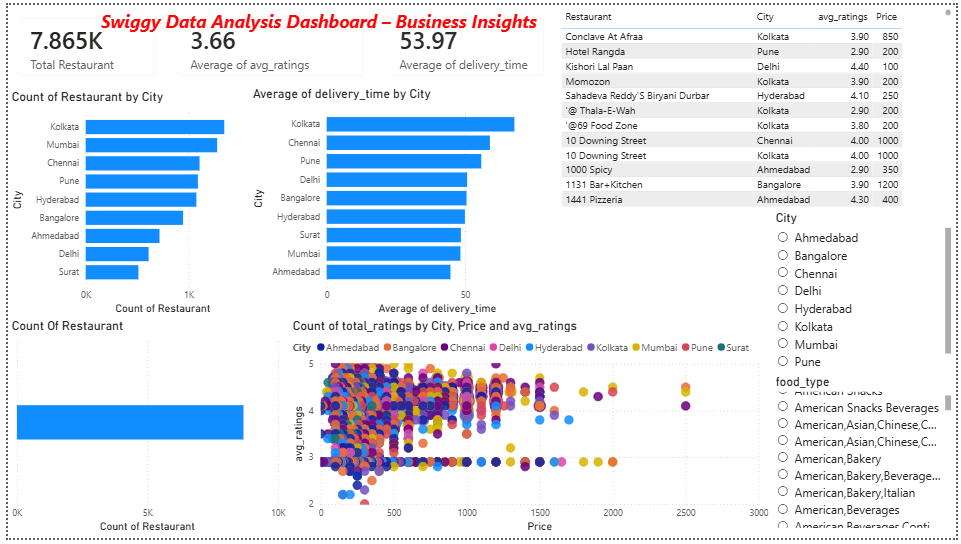
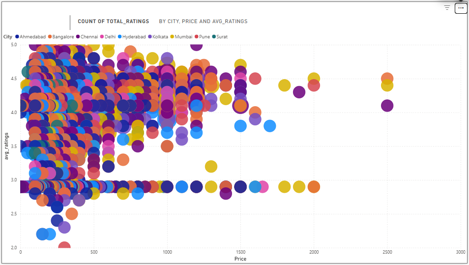

🍽️ Swiggy Data Analysis Dashboard

📌 Overview

This project focuses on analyzing Swiggy restaurant data to extract meaningful business insights related to customer preferences, pricing strategies, and delivery performance. The analysis is performed using SQL, and the results are visualized through an interactive Power BI dashboard.

📊 Dashboard Preview

🔹 Main Dashboard

🔹 Detailed Analysis View

🎯 Objectives

* Analyze restaurant distribution across cities
* Identify top-performing restaurants based on ratings
* Understand pricing trends and their impact on customer satisfaction
* Evaluate delivery performance across different cities
* Identify popular food categories

🛠️ Tools & Technologies

* **SQL (PostgreSQL)** – Data analysis and querying
* **Power BI** – Dashboard creation and visualization
* **Excel** – Data inspection and preprocessing

📂 Dataset Description

The dataset contains restaurant-level data with the following fields:

* ID
* Area
* City
* Restaurant
* Price
* Average Ratings
* Total Ratings
* Food Type
* Address
* Delivery Time

🔍 Key Analysis Performed

1. City-wise Restaurant Distribution

* Identified cities with highest number of restaurants
* Highlighted high competition areas

2. Delivery Time Analysis

* Compared average delivery time across cities
* Identified regions with slower delivery

3. Rating Analysis

* Evaluated average ratings
* Identified top-rated restaurants

4. Price vs Rating Analysis

* Analyzed relationship between pricing and customer satisfaction

5. Food Category Analysis

* Identified most popular cuisines

📈 Key Insights

* Metro cities such as Bangalore, Mumbai, and Delhi have higher restaurant density
* Delivery times vary significantly across cities, indicating operational inefficiencies
* Higher price does not necessarily result in better ratings
* Certain cuisines dominate across multiple cities
* Customer satisfaction depends on multiple factors beyond pricing

🚀 Business Recommendations

* Expand in cities with high demand but lower competition
* Optimize delivery operations in high-delay regions
* Focus on high-demand cuisines to maximize engagement
* Improve service quality for lower-rated restaurants

📁 Project Structure

SWIGGY_DATA_ANALYSIS/
│
├── Dashboard/
│   └── swiggy_dashboard.pbix
│
├── Dataset/
│   └── swiggy.csv
│
├── Images/
│   ├── dashboard.png
│   └── analysis.png
│
└── README.md

📌 Conclusion

This project demonstrates how data analysis and visualization can be used to uncover actionable insights and support business decision-making in the food delivery industry.

📎 Future Scope

* Add time-based trend analysis
* Incorporate customer-level data
* Apply predictive analytics for demand forecasting

